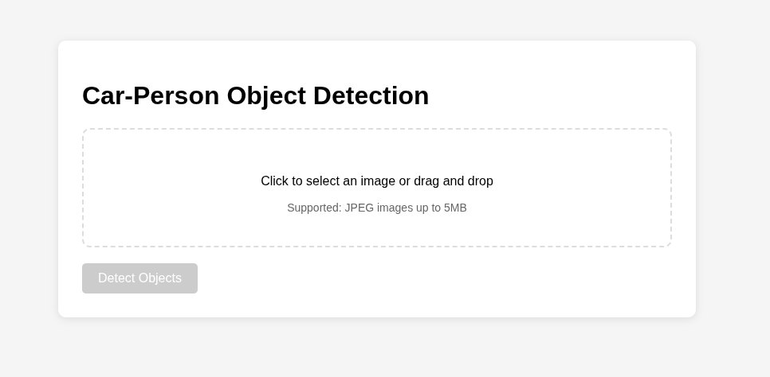

# Car-Person Object Detection

## Description

A YOLOv11n based model, used for detecting cars and people in images.

## Installation

### I. Pull Prebuilt Docker Image

The easiest way to run this project is to pull the prebuilt docker image and run the container locally:

1. Pull docker image
    ```bash
   $ docker pull nidaljaafar/zaka-object-detection
   ```
2. Run it
    ```bash
    $ docker run -p5000:5000 --name zaka-object-detection nidaljaafar/zaka-object-detection
    ```
The above will pull the image from dockerhub and run a container on port 5000.

### II. Build Docker Image Locally

Another way to run this project is by building the docker image locally.

1. Clone the project and build the image
    ```bash
   $ git clone https://github.com/nidalJaafar/zaka-object-detection.git 
   $ cd zaka-object-detection
   $ docker build -t zaka-object-detection .
   ```
2. Run the image locally
   ```bash
   $ docker run -p5000:5000 --name zaka-object-detection zaka-object-detection
   ```
### III. Run the Project Without Docker (Not Recommended)

The final way of running this project is using python3 (>= 3.11) with uv

> The following system libraries are required to run OpenCV on your system
> 
> `libgl1-mesa-glx` `libglib2.0-0` `libsm6` `libxrender1` `libxext6`
> 
> By default, they should be included on your system. Double check if they are found, otherwise please install them with your system's package manager.
> 
> Examples:
> 
> For Arch based systems
> 
> ```bash
>  $ sudo pacman -S mesa libglib2.0-0t64 libsm libxrender libxext
> ```
> For Debian based systems
> ```bash
>  $ sudo apt install libgl1-mesa-glx libglib2.0-0 libsm6 libxrender1 libxext6
> ```

1. Make sure uv is installed, if not install it with pip3 globally
   ```bash
   $ sudo pip3 install uv
   ```
2. Clone the project
   ```bash
   $ git clone https://github.com/nidalJaafar/zaka-object-detection.git
   $ cd zaka-object-detection
   ```
3. Resolve the dependencies
   ```bash
   $ uv sync --freeze
   ```
4. Run the Application
   ```bash
   $ uv run app.py
   ```
   
## Accessing the Application

By default the application will be running on http://localhost:5000 and the following UI will be displayed in your browser



## Working With the UI

The application supports jpeg images up to 5MB in size. The following illustrates the basic usage.


## Working With the API

The application provides an API endpoint `POST /api/v1/predict`

The API expects a form data request with an `image` file field.

Example:

```bash
$ curl --location 'http://localhost:5000/api/v1/predict' \
--form 'image=@"image.jpg"'
```

The response will be the actual image bytes with the bounding boxes.

Additionally, the application exposes a health endpoint `GET /health`

## Demo

You can try the application on the following https://zaka-object-detection.duckdns.org

## Limitations

The model is using YOLOv11n as a base model and was trained only on 200 distinct labeled images.

It will not be able to catch all the cars or people in the input image.

